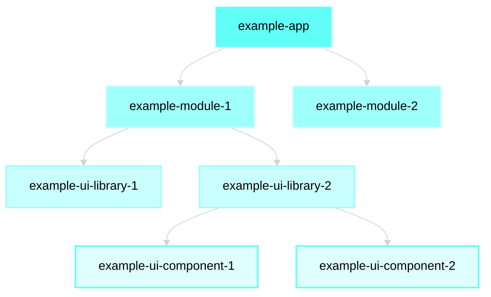

import EnlargableContent from '@/components/enlargable-content';
import { Steps } from 'nextra/components'
import Image from 'next/image';
import { Cards } from 'nextra/components'
import { Bleed  } from 'nextra-theme-docs'

# Intro to Gene 🧬

Gene is an opinionated React framework designed to bridge the gap between develpmpent speed project maintainability and scalability.

It highly leverages the power of **code generations** and **automation**. It is built on top of [Nx](https://nx.dev/concepts/mental-model) and [Nx Workspace Generators](https://nx.dev/packages/workspace/documents/overview).

<Bleed>
  <iframe
    className='sm:px-6 md:px-8 w-full h-96 2xl:ml-16 2xl:pr-40'
    src="https://www.youtube.com/embed/4A6s8aE_AzI"
    title="Brainly Gene Framework - high level overview"
    frameborder="0"
    allow="accelerometer; autoplay; clipboard-write; encrypted-media; gyroscope; picture-in-picture; web-share"
    referrerpolicy="strict-origin-when-cross-origin"
    allowfullscreen
  ></iframe>
</Bleed>

## Mental Model

Gene's mental model and architecture on the highest level is the following:



- An `app` is built up of one or many `modules`.
- A `module` consists of `components`, that are (usually) imported from `ui-libraries`.
  - One module can use as many ui-libraries as many it requires.
  - Modules can have their own components too if they are not shared and are 100% module specific.

`Gene Modules` are **standalone pieces of UI elements**, they have no dependency between each other.
Though, they can communicate with each other, but more on that later.

Important to mention: gene modules are
framework agnostic thanks to ✨_Dependency Injection_✨ (that we will talk about in the following chapters),
thus they can be used in NextJS or pure React or any other react framework if we wanted to do so.

**Let's see a "live" example!**

Through this example we will try to show how does a React application import modules and builds itself up.

_We have our beautiful UI:_

<EnlargableContent>
  <Image
    src="/get-started/my-app-base.png"
    width={901}
    height={621}
    alt="My app"
  />
</EnlargableContent>

If we dissect the application we can see that it is built up of Gene Modules that are built up of Components:

<EnlargableContent>
  <Image
    src="/get-started/my-app-dissected.png"
    width={1281}
    height={731}
    alt="My app"
  />
</EnlargableContent>

_Please notice that the background colors of the comments on the UI diagram
correspond with the blocks on our first diagram with the high level architecture_

On the diagram we mentioned NextJS but it can really be any React framework,
although currently **_we base our applications exclusively on NextJS._**

## Get Started

<Steps>
### Create new Gene workspace

```sh filename="Create a new Gene workspace named 'acme'" copy
npm init @brainly-gene acme
```

### Go to the created workspace

```sh copy
cd acme
```

### Open the workspace in your favorite code editor, e.g. VSCode

```sh copy
code .
```

### Generate a new Next.js app

```sh copy
pnpm nx g @brainly-gene/tools:nextjs-app --name my-first-app --directory web --no-interactive 
```

### Run the app 🥳

```sh copy
pnpm nx serve my-first-app
```

</Steps>


See [cheatsheet](/gene/cheatsheet) for more commands and tips.

