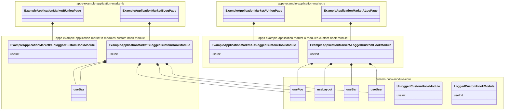

import Image from 'next/image';
import { Callout } from 'nextra-theme-docs';
import EnlargableContent from '@/components/enlargable-content';

# Branching

Branching in Gene allows for the creation of customized module variations to cater
to specific application or market needs. This strategic approach maintains a consistent
base while providing necessary flexibility, crucial in large-scale projects where modules
need to cater to a wide range of functionalities. Branching ensures that Gene modules
remain versatile yet coherent, aligning with different project needs while minimizing
code redundancy.

## Using Module in Applications

A starting point for describing branching concept will include `CustomHookModule` from [custom hooks guide](/gene/modules/custom-hooks).

```tsx filename="CustomHookModule.tsx" showLineNumbers
import {
  Foo,
  Loading,
  Error,
  FooPropsType,
  Layout,
  Bar,
  BarPropsType,
} from '@acme/components/simple-ui';
import { FooComponentMapStatesType, useFoo } from './hooks/useFoo';
import { BarComponentMapStatesType, useBar } from './hooks/useBar';
import { useLayout } from './hooks/useLayout';

const useInit = () => {
  const ref = React.useRef(null);

  const { fooProps, useFooMediators, useFooComponentMap } = useFoo({ ref });
  const { barProps, useBarMediators, useBarComponentMap } = useBar({ ref });
  const { layoutProps } = useLayout();

  const useMediators = () => {
    useFooMediators();
    useBarMediators();
  };

  return {
    ref,
    fooProps,
    useFooComponentMap,
    barProps,
    layoutProps,
    useBarComponentMap,
    useMediators,
  };
};

const fooComponentMap = new Map<
  FooComponentMapStatesType,
  React.ComponentType<FooPropsType>
>([
  ['success', Foo],
  ['loading', Loading],
]);

const barComponentMap = new Map<
  BarComponentMapStatesType,
  React.ComponentType<BarPropsType>
>([
  ['success', Bar],
  ['loading', Loading],
  ['error', Error],
]);

export const ModuleWithCustomHooks = () => {
  const {
    ref,
    fooProps,
    useFooComponentMap,
    barProps,
    layoutProps,
    useBarComponentMap,
    useMediators,
  } = useInit();

  useMediators();

  const FooComponent = useFooComponentMap(fooComponentMap, Loading);
  const BarComponent = useBarComponentMap(barComponentMap, Loading);

  return (
    <div ref={ref}>
      <Layout
        foo={<FooComponent {...fooProps} />}
        bar={<BarComponent {...barProps} />}
        {...layoutProps}
      />
    </div>
  );
};
```

Now, let's consider using `CustomHookModule` inside `ExampleApplicationMarketA`.

**Gene promotes keeping modules used by the application close to the app.**

Due to this fact, `CustomHookModule` should be placed close to the app. The conceptual view is presented in the diagram below:


`CustomHookModule` is kept in the `ExampleApplicationMarketA` namespace. This means `CustomHookModule` would be used solely by this application. This approach secures two important things:

- **Feature flags mitigation** - if `CustomHookModule` were used by several different applications/markets, it would require including logic forking inside the module, and, in certain cases, creating quasi-configs per app, loaded by the module either via `AppContext` or Dependency Injection. This approach, commonly described as feature flags, can be risky when used inside modules. Therefore, Gene suggests having as much logic forking as possible on the app/page level while using specialized modules inside. In this solution, each module can be tested in isolation as it does not contain any hidden forking inside.
- **Code navigation** - when all modules used by the application are kept in a single place, it becomes easier to maintain the application.

**The exact location where modules tied to the application/market should be gathered is resolved at the generator level. Generators will suggest an appropriate place for modules used solely by certain applications.**

## Copying

Let's assume there is another version of `ExampleApplicationMarketA`, named `ExampleApplicationMarketB`. This scenario covers cases like having many markets (where each market is a separate app) or just another product reusing some of the modules.

Another assumption is that `CustomHookModule` is a new feature not yet established and used in multiple applications. If that is the case, the composition option would be suitable (the next section describes the process).

Based on these assumptions, the following steps should be conducted to use `CustomHookModule` in `ExampleApplicationMarketB`.

1. Copy the code of `CustomHookModule` together with its custom hooks to a folder close to `ExampleApplicationMarketB`.
2. Add prefixes to the modules, so the code is clearer. For this case, prefixes can be added using the application name. For example, `ExampleApplicationMarketA` would have `ExampleApplicationMarketACustomHookModule` and so on.
3. Modify modules accordingly to the application needs. For example, `ExampleApplicationMarketBCustomHookModule` will alter the UI displayed in place of `Bar` by replacing it with the `Baz` component.

Core module library can be generated using the NX generator:

```shell copy
nx g @brainly-gene/tools:core-module
```

The structure after application changes can be visualized as below:

<EnlargableContent>

</EnlargableContent>


There are a couple of things worth noting when translating this diagram into code:

- `Bar` and `Baz` components were moved close to the apps as modules since they are used only by particular application module versions.
- Other components and services remained in common directories—they are, after all, reused.
- `useLayout`, `useFoo`, and `useBar` were copied.

**Custom hooks are used only in combination with the module, so they shouldn't be reused without ensuring that their reuse won't introduce unclear and untested code dependencies between entities. These custom hooks have not been prefixed by the application name as they should not be exported.**

## Core Module and Composition

As concluded in the previous section, `useLayout` and `useBar` were copied. However, there are cases where copying is not the best solution. If the module is already used by multiple applications and there is a clearly distinguishable set of **core functionalities**, it's better to extract those functionalities into a separate module that can be composed with other modules.

In this case, the code of `useLayout` and `useBar` should be extracted into a separate module, named `CustomHookModuleCore`. This module should represent the core functionalities and be used by both `ExampleApplicationMarketA` and `ExampleApplicationMarketB`. `CustomHookModuleCore` should serve similarly to abstract classes in object-oriented programming, meaning it should not be used directly by the application.

**Core Module is an abstract representation of features used among all variations of the module. It exports custom hooks corresponding to core functionalities and should not be used directly by applications.**

Here's the simplified representation of the example of how to extract the core functionalities from `ExampleApplicationMarketBCustomHookModule` and `ExampleApplicationMarketACustomHookModule`:

<EnlargableContent>

</EnlargableContent>
As presented in the diagram, modules used by `ExampleApplicationMarketA` and `ExampleApplicationMarketB` are using `CustomHookModuleCore` as a core module. This module is responsible for exporting custom hooks that are used by the application modules. Application modules are using **composition** to combine core and market-specific functionalities.

### Core modules requirements

Core modules, being reusable across multiple module variations, should meet high-quality standards. They should be written in the best possible way and maintained by Senior+ Developers. They must be well-tested and documented and checked against Gene's syntax checks. Core modules should not contain any market-specific logic or dependencies.

It is suggested to have unit tests for every custom hook exported by the core module to ensure that the core module works as expected and can be safely used by other modules. Integration tests (e.g. using Storybook) are recommended to ensure the custom hooks work well together. An additional benefit of integration tests is that they can serve as documentation for core module functionalities.

### Core functionalities definition

Core functionalities are the features used by at least a significant part of the module variations. They should not represent behaviors specific to particular apps or markets. Custom hooks can also be considered core functionalities if they are expected to be used by multiple module variations.

Per `CustomHookModuleCore` example, assume that `Bar` is considered a core functionality as it will be used in future applications (e.g., `ApplicationC`, `ApplicationD`, etc.), while `Baz` is a market-specific feature. In this case, `Bar` should be extracted to `CustomHookModuleCore`, and `Baz` should be kept in `ExampleApplicationMarketBCustomHookModule`.


<EnlargableContent>


</EnlargableContent>

### Module variation in the same library

If there are variants of a module that are used by the same application, or if there is a core module variation that is reused, it should be placed next to the original module.

An example of such a case is having `LoggedCustomHookModule`, a variation of `CustomHookModule` (where the original `CustomHookModule` will then be renamed to `UnloggedCustomHookModule`), displayed for logged-in users. In this case, applications have a dedicated page for logged users, and they are not using the same custom hook module as unlogged users. `LoggedCustomHookModule` should be placed next to `UnloggedCustomHookModule` and should reuse its custom hooks.

If there is no Core module distinguished yet, the diagram for such a case would look like below:

<EnlargableContent>

</EnlargableContent>

In this case, if there is a Core module distinguished, `useUser` can be treated as a core functionality since it is reused. If there is a distinguished core module for the `CustomHookModule`, the diagram would look as follows:

<EnlargableContent>

</EnlargableContent>

**Adding module variations to the same library should be used in all cases where the variation is created not for another app but for a specific scenario within the app.**

## Inheritance

Inheritance is a method of creating a new module variation based on the existing one using the special Gene declaration `extendGeneModule`. This method is used for short-lived variations that are slightly modifying the original module. Inheritance is a good choice for experiments that do not modify the original module in a significant way.

**Core modules should not be inherited; inheritance is used for creating variations of modules used by applications.**

## Modules Naming

Naming should complement the module placement to help determine in which scope the module is being used. The scope can be determined by:

- Application name - if the module is used by a single application. For example, `ExampleApplicationMarketACustomHookModule`.
- Type of page - if the module is used by a specific page or page type. For example, `NewsPageHeaderModule`.
- Scenario - if the module is used in a specific scenario. Scenarios may vary between applications. They could imply whether the user is logged in or has access to specific features. For example, `LoggedCustomHookModule`, `UnloggedCustomHookModule`.

Naming should be clear and concise. It should not be too long, but it should provide enough information to understand the module's purpose.

## Module Creation Visual Guide

The diagram below shows the reasoning path when creating module variations and choosing the appropriate branching method.

<EnlargableContent>

</EnlargableContent>

## Modules Placement and Generation (NX ecosystem)

The placement of the module variation is crucial for maintaining a clean and easily navigable codebase. Gene promotes the following rules:

- Core modules should be placed in the shared directory. In the `NX` ecosystem, this would be the `libs` directory. The directory can then be further scoped to provide better organization based on broader features. These features might correspond to products and pages.
- Modules used by a single application should be placed in a directory associated with the application. By default, there could be a library of modules used exclusively by the market. If needed, this library can be further split into smaller libraries for scaling purposes.

<Callout type="warning" emoji="⚠️">
  The placement of the module described below is not yet implemented within
  module generators. It is a subject for future development and once
  implemented, it will be described both in this section and in the generator
  documentation.
</Callout>

In the NX ecosystem, module placement should be done in the following way:

### Core Module

Core modules should be placed in the `libs` directory. Further directories scoping depends on the specific domains/applications or other factors limiting where the module can be used. Widely reusable modules, like those related to authentication, can be scoped as `libs/authentication/modules/**`. Modules used exclusively in an application consisting of more than one market can be scoped using the app name, e.g., `libs/my-application/modules/**`.

```text {5..9,10..21}
<repository-directory>
├── README.md
├── package.json
├── apps
│   └── my-domain/
│        └──  modules/
│             ├── simple-module-e2e/
│             │    ├── cypress.config.ts
│             │    ...other cypress files with default test...
├── libs
│    └── my-domain
│        └── modules
│            └── simple-module
│                ├── src
│                │   └── lib
│                │       └── hooks
│                │           └── ...
│                │       └── SimpleModule.tsx
│                │       └── index.ts
│                │       └── SimpleModule.stories.tsx
│                ├── .storybook
```

In case a module variation is created, it should be placed in the same library, next to the original module. Let's consider a variation of `SimpleModule` named `SimpleVariationModule`.

```text {19}
<repository-directory>
├── README.md
├── package.json
├── apps
│   └── my-domain
│        └──  modules/
│             ├── simple-module-e2e
│             │    ├── cypress.config.ts
│             │    ...other cypress files with default test...
├── libs
│    └── my-domain
│        └── modules
│            └── simple-module
│                ├── src
│                │   └── lib
│                │      └── hooks
│                │           └── ...
│                │       └── SimpleModule.tsx
│                │       └── SimpleVariationModule.tsx
│                │       └── index.ts
│                │       └── SimpleModule.stories.tsx
│                ├── .storybook
```

The same pattern should be used in further variations of the module.

### Modules used by a market

Modules used by a single application should be placed in a dedicated library, with the name implying its exclusive use by the application. For example, `ExampleApplicationMarketA` might use `app-modules` as the library name suffix.

```text {12..33}
<repository-directory>
├── README.md
├── package.json
├── apps
│   └── example-application
│        └──  market-a
│             ├── ... all app files
│        └──  market-b
│             ├── ... all app files
├── libs
│    └── example-application
│        └── market-a
│            └── app-modules
│                ├── src
│                │   └── lib
│                │       └── simple-module
|                │           └── hooks
|                │               └── ...
|                │           └── ExampleApplicationMarketASimpleModule.tsx
│                │           └── ExampleApplicationMarketASimpleModule.stories.tsx
|                │           └── index.ts
│                ├── .storybook
│        └── market-b
│            └── app-modules
│                ├── src
│                │   └── lib
│                │       └── simple-module
|                │           └── hooks
|                │               └── ...
|                │           └── ExampleApplicationMarketBSimpleModule.tsx
│                │           └── ExampleApplicationMarketBSimpleModule.stories.tsx
|                │           └── index.ts
│                ├── .storybook
```

### Module used by market

Modules used by a single application should be placed in a single library whose name should correspond to the application name. The library name suffix should imply that it is used exclusively by the application — in the example below, and for generators, `app-modules` is the last piece of the library name. Considering two markets for the application: `ExampleApplicationMarketA` and `ExampleApplicationMarketB`, and the application versions of `SimpleModule`, the structure should look like this:

```text {12..33}
<repository-directory>
├── README.md
├── package.json
├── apps
│   └── example-application
│        └──  market-a
│             ├── ... all app files
│        └──  market-b
│             ├── ... all app files
├── libs
│    └── example-application
│        └── market-a
│            └── app-modules
│                ├── src
│                │   └── lib
│                │       └── simple-module
|                │           └── hooks
|                │               └── ...
|                │           └── ExampleApplicationMarketASimpleModule.tsx
│                │           └── ExampleApplicationMarketASimpleModule.stories.tsx
|                │           └── index.ts
│                ├── .storybook
│        └── market-b
│            └── app-modules
│                ├── src
│                │   └── lib
│                │       └── simple-module
|                │           └── hooks
|                │               └── ...
|                │           └── ExampleApplicationMarketBSimpleModule.tsx
│                │           └── ExampleApplicationMarketBSimpleModule.stories.tsx
|                │           └── index.ts
│                ├── .storybook
```

As e2e tests are optional for modules used directly in the application, e2e tests for the module can be placed in the corresponding directory under `apps`, if this is pointed out in the generator.

```text {10..15}
<repository-directory>
├── README.md
├── package.json
├── apps
│   └── example-application
│        └──  market-a
│             ├── ... all app files
│        └──  market-b
│             ├── ... all app files
│        └──  market-a-app-modules-e2e
│             ├── cypress.config.ts
│             ...other cypress files with default tests...
│        └──  market-b-app-modules-e2e
│             ├── cypress.config.ts
│             ...other cypress files with default tests...
├── libs
│    └── example-application
│        └── market-a
│            └── app-modules
│                ├── src
│                │   └── lib
│                │       └── ...
│                ├── .storybook
│        └── market-b
│            └── app-modules
│                ├── src
│                │   └── lib
│                │       └── ...
│                ├── .storybook
```

When generating another module for the application, the structure should be kept consistent. The new module should be placed in the same library as the previous one. Let’s consider `AnotherModule` added to both applications.

```text {22..27,39..44}
<repository-directory>
├── README.md
├── package.json
├── apps
│   └── example-application
│        └── market-a
│             ├── ... all app files
│        └── market-b
│             ├── ... all app files
├── libs
│    └── example-application
│        └── market-a
│            └── app-modules
│                ├── src
│                │   └── lib
│                │       └── simple-module
|                │           └── hooks
|                │               └── ...
|                │           └── ExampleApplicationMarketASimpleModule.tsx
│                │           └── ExampleApplicationMarketASimpleModule.stories.tsx
|                │           └── index.ts
│                │       └── another-module
|                │           └── hooks
|                │               └── ...
|                │           └── ExampleApplicationMarketAAnotherModule.tsx
│                │           └── ExampleApplicationMarketAAnotherModule.stories.tsx
|                │           └── index.ts
│                ├── .storybook
│        └── market-b
│            └── app-modules
│                ├── src
│                │   └── lib
│                │       └── simple-module
|                │           └── hooks
|                │               └── ...
|                │           └── ExampleApplicationMarketBSimpleModule.tsx
│                │           └── ExampleApplicationMarketBSimpleModule.stories.tsx
|                │           └── index.ts
│                │       └── another-module
|                │           └── hooks
|                │               └── ...
|                │           └── ExampleApplicationMarketBAnotherModule.tsx
│                │           └── ExampleApplicationMarketBAnotherModule.stories.tsx
|                │           └── index.ts
│                ├── .storybook
```

If a variation of `SimpleModule` is created, it can be kept in the same directory as the original module. Let’s consider `SimpleVariationModule` added to `ExampleApplicationMarketA`.

```text {20}
<repository-directory>
├── README.md
├── package.json
├── apps
│   └── example-application
│        └── market-a
│             ├── ... all app files
│        └── market-b
│             ├── ... all app files
├── libs
│    └── example-application
│        └── market-a
│            └── app-modules
│                ├── src
│                │   └── lib
│                │       └── simple-module
|                │           └── hooks
|                │               └── ...
|                │           └── ExampleApplicationMarketASimpleModule.tsx
|                │           └── ExampleApplicationMarketASimpleVariationModule.tsx
│                │           └── ExampleApplicationMarketASimpleModule.stories.tsx
|                │           └── index.ts
│                │       └── another-module
|                │           └── hooks
|                │               └── ...
|                │           └── ExampleApplicationMarketAAnotherModule.tsx
│                │           └── ExampleApplicationMarketAAnotherModule.stories.tsx
|                │           └── index.ts
│                ├── .storybook
│        └── market-b
│            └── app-modules
│                ├── ...
```

## FAQ

> Module used by the application has slightly different behavior than the core one for certain custom hooks. Should I introduce an input parameter to the custom hook to handle the difference?

No, this is not a good idea. Custom hooks should be used consistently across the module. If you need to handle different behaviors, it is better to create a separate custom hook for the variation by copying it and then changing the behavior. Gene promotes copying over abstracting custom hooks with input parameters.

> My core module uses a custom hook that imports two other custom hooks. In my module used by the application, I want to change the behavior of one of the child custom hooks. Should I introduce an input parameter to the custom hook to handle the difference?

No, in this case, parameters are not a good idea either. If the case covers altering `useFooBar` from [development guide](/gene/modules/development), it is better to copy `useFooBar` and the child custom hook with the different logic, then change its behavior. The child custom hook that remains unchanged should be imported from the core module.

## Further reading

This guide covers creating module variations and choosing the appropriate branching method. [Next guide](/gene/modules/dependencies) will cover all dependencies used by the module and how to manage them.
