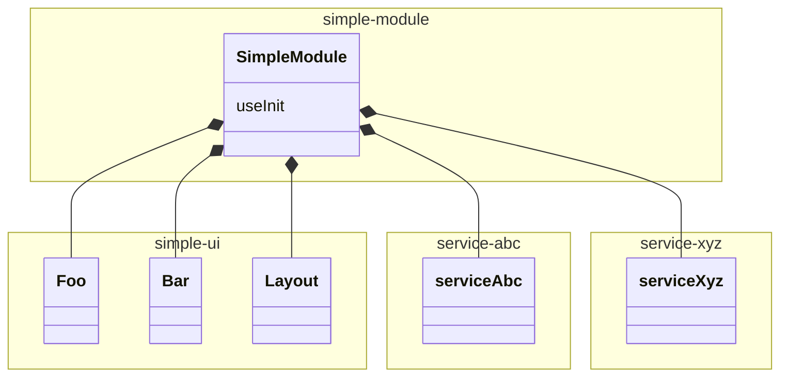
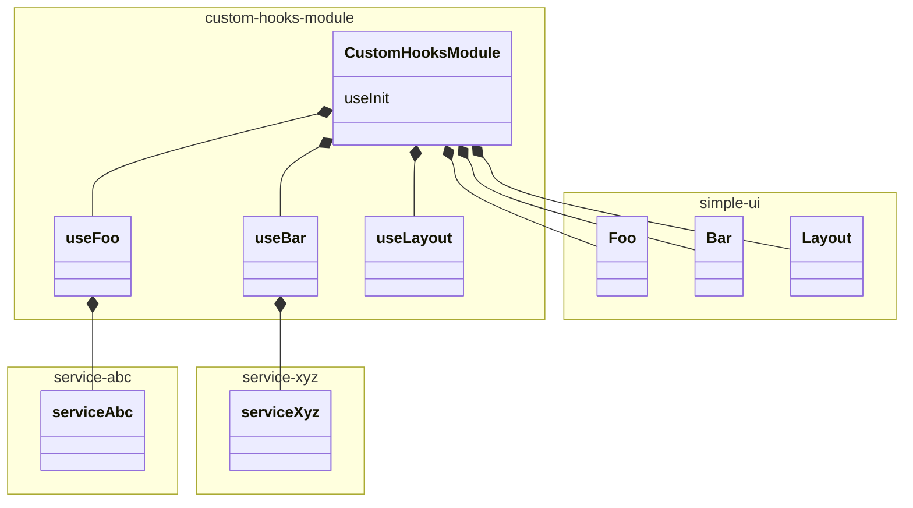
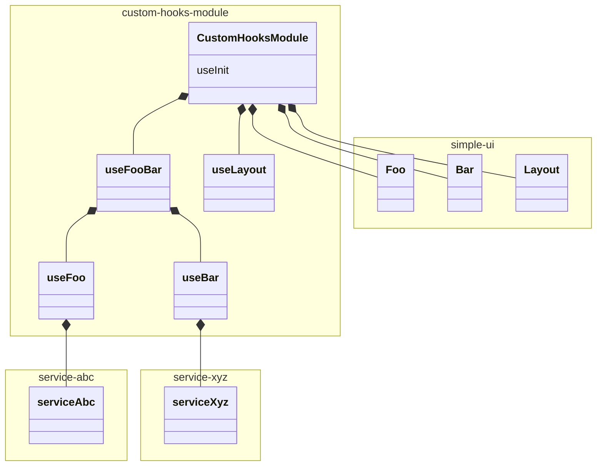

import Image from 'next/image';

# Custom Hooks

Custom hooks in Gene modules involve breaking down the module logic into distinct,
functional segments. This pattern enhances scalability, aids in the composition of the module's capabilities, and ensures that the module's logic is organized and maintainable. Custom hooks encapsulate specific functionalities, supporting easier testing and debugging, and allowing common functionalities to be shared across different modules.

Custom hooks are used for two main purposes:

- **Code organization** - breaking down the module logic into distinct, functional segments called custom hooks.
- **Code reusability** - allowing common functionalities to be shared across different modules. This concept will be further developed in the [branching](/gene/modules/branching) section.

**Due to these purposes, custom hooks should be used in every module that does not represent a single feature (e.g., `SimpleModule`).**

## Using custom hooks in a simple module

Let's assume the starting point for working on the custom hooks example is a simple module from the [development](/gene/modules/development) section.

```tsx filename="SimpleModule.tsx" showLineNumbers
import {Foo, Loading, FooButtonClick, FooEventsType, FooPropsType} from "@acme/components/simple-ui";
import {useServiceAbc, AbcType} from "@acme/services/service-abc";
import {useMediator} from '@brainly-gene/core'

type TransformedAbcType = {
  items: Array<number>;
  sumCount: number;
};

const transformAbc = (data: AbcType | null): TransformedAbcType => {
  return (data || []).reduce(
    (accData: TransformedAbcType, rawItem: { id: string; count: number }) => {
      const { items, sumCount } = accData;

      return {
        items: [...items, Number(rawItem.id)],
        sumCount: sumCount + rawItem.count,
      };
    },
    {
      items: [],
      sumCount: 0,
    },
  );
};

type FooComponentMapStatesType = 'success' | 'loading';

const useInit = () => {
  const {data, loading, error} = useServiceAbc();

  const {items, sumCount} = React.useMemo(() => transformAbc(data), [data]);

  const [additionalItems, setAdditionalItems] = React.useState<number[]>([]);

  const list = React.useMemo(
    () => (items ? [...items, ...additionalItems] : []),
    [items, additionalItems],
  );

  const useMediators = () => {
    useMediator<FooButtonClick>(
      FooEventsType.ON_BUTTON_CLICK,
      () => setAdditionalItems((curr) => [...curr, 1]),
      ref,
    );
  };

  const useFooComponentMap = React.useCallback(
    (componentMap: Map<FooComponentMapStatesType, React.ComponentType<FooPropsType>>, DefaultComponent: React.ComponentType<FooPropsType>) => {
    if (loading) {
        return componentMap.get('loading') || DefaultComponent
    }

    return componentMap.get('success') || DefaultComponent;
  }, [loading]);

  return {
    fooProps: {
      list,
      sumCount
    }
    ref,
    useMediators,
    useFooComponentMap
  }
}

const RawSimpleModule = () => {
  const {
    fooProps,
    ref,
    useMediators,
    useFooComponentMap
  } = useInit();

  useMediators();

  const FooComponent = useFooComponentMap(FooComponentMap, Loading);

  return (
    <div ref={ref}>
      <FooComponent {...fooProps} />
    </div>
  );
};

const {declarations, module: SimpleModule} = createGeneModule({
  module: RawSimpleModule,
  declarations: {},
});

export {SimpleModule, declarations};
```

### Additional features

For the example purpose, `SimpleModule` from now on will be named `CustomHooksModule`. The module will be extended with additional features:

- Displaying `Bar` component using data from `serviceXYZ`
- Displaying `Foo` and `Bar` inside `Layout` component

With the inclusion of new features, dependencies diagram should look like this:



### Why use custom hooks?

Now, there are a couple of issues if the logic related to powering all of the displayed components won't be handled by separate functions (custom hooks):

- **Code organization** - with a single feature, a file is already ~100 LOC. Adding 2 features will likely triple its size. This issue will be even more significant in production code, which consists of a bigger number of features, each with a higher amount of logic.
- **Code reusability** - the code won't be reusable with other module variations. This won't allow for using a composition approach in module branching. More on this in the [branching](/gene/modules/branching) section.

Therefore, in such situations, Gene suggests handling the logic for each distinguishable UI piece with a custom hook.

### Handling the `Foo` component with a custom hook

First, let's handle the `Foo` component with a custom hook. The custom hook will be responsible for transforming data from `serviceAbc` and handling button click events. The code is literally moved from the original `SimpleModule` code and put into a dedicated function.

**For a framework-agnostic approach, custom hooks are named like `fooHook` in documentation and diagrams. For example, in React, `fooHook` means the `useFoo` hook.**

```tsx filename="/hooks/useFoo.ts"
import {
  FooButtonClick,
  FooEventsType,
  FooPropsType,
} from '@acme/components/simple-ui';
import { useServiceAbc, AbcType } from '@acme/services/service-abc';
import { useMediator } from '@brainly-gene/core';
import * as React from 'react';

type TransformedAbcType = {
  items: Array<number>;
  sumCount: number;
};

const transformAbc = (data: AbcType | null): TransformedAbcType => {
  return (data || []).reduce(
    (accData: TransformedAbcType, rawItem: { id: string; count: number }) => {
      const { items, sumCount } = accData;

      return {
        items: [...items, Number(rawItem.id)],
        sumCount: sumCount + rawItem.count,
      };
    },
    {
      items: [],
      sumCount: 0,
    },
  );
};

export type FooComponentMapStatesType = 'success' | 'loading';

export const useFoo = ({
  ref,
}: {
  ref: React.MutableRefObject<HTMLElement | null>;
}) => {
  const { data, loading } = useServiceAbc();

  const { items, sumCount } = React.useMemo(() => transformAbc(data), [data]);

  const [additionalItems, setAdditionalItems] = React.useState<number[]>([]);

  const list = React.useMemo(
    () => (items ? [...items, ...additionalItems] : []),
    [items, additionalItems],
  );

  const useFooMediators = () => {
    useMediator<FooButtonClick>(
      FooEventsType.ON_BUTTON_CLICK,
      () => setAdditionalItems((curr) => [...curr, 1]),
      ref,
    );
  };

  const useFooComponentMap = React.useCallback(
    (
      componentMap: Map<
        FooComponentMapStatesType,
        React.ComponentType<FooPropsType>
      >,
      DefaultComponent: React.ComponentType<FooPropsType>,
    ) => {
      if (loading) {
        return componentMap.get('loading') || DefaultComponent;
      }

      return componentMap.get('success') || DefaultComponent;
    },
    [loading],
  );

  return {
    fooProps: {
      list,
      sumCount,
    },
    useFooMediators,
    useFooComponentMap,
  };
};
```

The `ref` variable is reused for module mediation in Gene, making it the only argument passed to the hook.

With the custom hook, the module code will look much simpler:

```tsx filename="CustomHooksModule.tsx" showLineNumbers {2,7}
import { Foo, Loading, FooPropsType } from '@acme/components/simple-ui';
import { FooComponentMapStatesType, useFoo } from './hooks/useFoo';

const useInit = () => {
  const ref = React.useRef(null);

  const { fooProps, useFooMediators, useFooComponentMap } = useFoo({ ref });

  return {
    fooProps,
    ref,
    useFooMediators,
    useFooComponentMap,
  };
};

const FooComponentMap = new Map<
  FooComponentMapStatesType,
  React.ComponentType<FooPropsType>
>([
  ['success', Foo],
  ['loading', Loading],
]);

export const CustomHooksModule = () => {
  const { fooProps, ref, useFooMediators, useFooComponentMap } = useInit();

  useFooMediators();

  const FooComponent = useFooComponentMap(FooComponentMap, Loading);

  return (
    <div ref={ref}>
      <FooComponent {...fooProps} />
    </div>
  );
};
```

### What makes a good custom hook

Gene considers custom hooks as a way to assemble the module in the best possible way. There are several key points that should be considered when creating a custom hook:

- **Encapsulation** - a custom hook should encapsulate a specific functionality or feature, ensuring that only necessary dependencies are being passed as input. The hook should resolve its dependencies without relying on external input, except for dependencies that cannot be passed via Dependency Injection, are imposed by the module's architecture (e.g., some modules can accept props for iterating them - then those props like index or id can be passed to the hook) or framework limitations (e.g., React ref passed for event mediation purposes).

- **Specialization** - a custom hook should provide a specific functionality or feature, ensuring that it is not too broad or too narrow. The best practice is to couple the hook to a certain piece of UI (usually a certain component).

The `useFoo` hook represents both indicators of a good custom hook, as it does not accept any input besides essential ones and corresponds exactly to the UI piece props it represents. The only job the module is doing is to call side effects, obtain the component from the component map and pass the props to appropriate components.

**A general rule when writing custom hooks is to represent a single UI piece that does not communicate with other features of the module. Communication cases are covered in further sections.**

### Adding custom hooks for other features

By using custom hooks, it will be easy to repeat the pattern for `Bar` and `Layout` accordingly:

```tsx filename="CustomHooksModule.tsx" showLineNumbers {1,3,4,10,11,13..16,22..25,37..44,51..54,60,64..68}
import {
  Foo,
  Loading,
  Error,
  FooPropsType,
  Layout,
  Bar,
  BarPropsType,
} from '@acme/components/simple-ui';
import { FooComponentMapStatesType, useFoo } from './hooks/useFoo';
import { BarComponentMapStatesType, useBar } from './hooks/useBar';
import { useLayout } from './hooks/useLayout';

const useInit = () => {
  const ref = React.useRef(null);

  const { fooProps, useFooMediators, useFooComponentMap } = useFoo({ ref });
  const { barProps, useBarMediators, useBarComponentMap } = useBar({ ref });
  const { layoutProps } = useLayout();

  const useMediators = () => {
    useFooMediators();
    useBarMediators();
  };

  return {
    ref,
    fooProps,
    useFooComponentMap,
    barProps,
    layoutProps,
    useBarComponentMap,
    useMediators,
  };
};

const fooComponentMap = new Map<
  FooComponentMapStatesType,
  React.ComponentType<FooPropsType>
>([
  ['success', Foo],
  ['loading', Loading],
]);

const barComponentMap = new Map<
  BarComponentMapStatesType,
  React.ComponentType<BarPropsType>
>([
  ['success', Bar],
  ['loading', Loading],
  ['error', Error],
]);

export const ModuleWithCustomHooks = () => {
  const {
    ref,
    fooProps,
    useFooComponentMap,
    barProps,
    layoutProps,
    useBarComponentMap,
    useMediators,
  } = useInit();

  useMediators();

  const FooComponent = useFooComponentMap(fooComponentMap, Loading);
  const BarComponent = useBarComponentMap(barComponentMap, Loading);

  return (
    <div ref={ref}>
      <Layout
        foo={<FooComponent {...fooProps} />}
        bar={<BarComponent {...barProps} />}
        {...layoutProps}
      />
    </div>
  );
};
```

Below diagram represents dependencies between all entities used in custom hooks module:



Structure below represents filesystem of the module with applied custom hooks.

```
<module-directory>
├── index.ts
└── CustomHooksModule.tsx
└── hooks
│   ├── useFoo.ts
│   ├── useBar.ts
│   └── useLayout.ts
```

### Composition using UI and custom hooks

As presented in the custom hooks example, the best way to compose modules is to use the composition of features based on the UI. A crown example in the React world is the slot pattern that allows for displaying components inside other components. As in the custom hooks example, there is no need to merge `Layout`, `Foo`, and `Bar` logic despite those elements' display being highly dependent on each other. This approach could be summed up as **Composition using UI**, and it should always be used if there is such a possibility. Three independent custom hooks are better than one bulk hook.

However, there are situations that require composing features within the module that communicate with each other. For example, clicking the `Foo` button should trigger an action inside `Bar`.

Using `AppContext` should be taken out of the equation, as this is a tool for communicating **between** modules, not **within** a module.

If `Foo` and `Bar` are communicating in a way that they modify each other's state, it means they should be treated as a single feature instead of two separate ones. In this case, **Composition using custom hooks** should be used. In such a case, the logic related to the communication should be lifted to the new custom hook that should import both the `useFoo` and `useBar`. This hook should provide props for both of those features and handle communication between them. The important thing here is the interface of the `useFoo` and `useBar` as they have to lower their encapsulation level in order to accept incoming communication. The best way is to expose handlers that will then be wrapped in a mediator function inside the wrapping hook:

```tsx filename="/hooks/fooBar/useFooBar.ts"
import { useBar } from './useBar';
import { useFoo } from './useFoo';

export const useFooBar = ({
  ref,
}: {
  ref: React.MutableRefObject<HTMLElement | null>;
}) => {
  const {
    fooProps,
    handlers: { handleFooClick },
    useFooComponentMap,
  } = useFoo({ ref });
  const {
    barProps,
    useBarMediators,
    useBarComponentMap,
    handlers: { handleBarRefetch },
  } = useBar({ ref });

  const useFooBarMediators = () => {
    useMediator<FooButtonClick>(
      FooEventsType.ON_BUTTON_CLICK,
      () => {
        handleFooClick();
        handleBarRefetch();
      },
      ref,
    );

    useBarMediators();
  };

  return {
    fooProps,
    barProps,
    useFooComponentMap,
    useBarComponentMap,
    useFooBarMediators,
  };
};
```

Then `useFooBar` can be used instead of individual `useFoo` and `useBar` within the module.



Structure below represents filesystem of the module with applied custom hooks.

```
<module-directory>
├── index.ts
└── CustomHooksModule.tsx
└── hooks
│   ├── fooBar
│       ├── useFooBar.ts
│       ├── useFoo.ts
│       └── useBar.ts
```

**As presented, there is no requirement for having exact mapping 1 custom hook - 1 component. 1 custom hook - n components can be used in cases as above. However, n custom hooks - 1 component should be avoided as it will introduce unnecessary props drilling.**

## FAQ

> How to name custom hooks?

Custom hooks should be named based on the feature they represent. For example, if the hook is responsible for handling the `AnswerContent` component, it should be named `useAnswerContent`. This naming convention helps to identify the purpose of the hook and makes the code more readable.

> Can custom hooks use dependency injection functions?

Yes, custom hooks can use dependency injection functions to access services, functions like router, translations, and other dependencies.

> Should custom hooks render UI?

No, custom hooks should not render UI. They should only contain the logic for a specific feature or functionality. The UI should be rendered in the main module file. This separation of concerns makes the code more maintainable and easier to test, and it's aligned with the builder pattern.

## Further reading

For more information on custom hooks, check out [the official React documentation on Hooks](https://react.dev/learn/reusing-logic-with-custom-hooks). This guide covers creating complex modules with multiple features that often communicate with each other. The next guide will show how to create module variations based on the multiple ways Gene provides, including composition using already created hooks.
